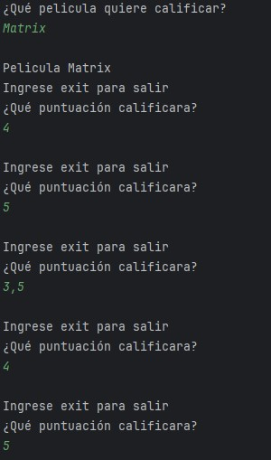

# Desafio de java clase 1

En la inmersion de java por Alura Latam, nos sumergimos en los fundamentos del lenguaje como ser los tipos de datos y las estructuras de control, asi empleando estos conocimientos en el desafio en realizar un programa para ver la calificación de una pelicula ingresada, obteniendo el promedio de las calificaciones dadas.

## Empezar a usar el programa

1. Ejecutar el programa
2. Ingresar el nombre de la película a calificar
3. Ingresar las calificaciones
4. Para salir, ingrese 'exit' para terminar las calificaciones
5. Visualización del promedio de las calificaciones

### Ejemplo de salida

 

